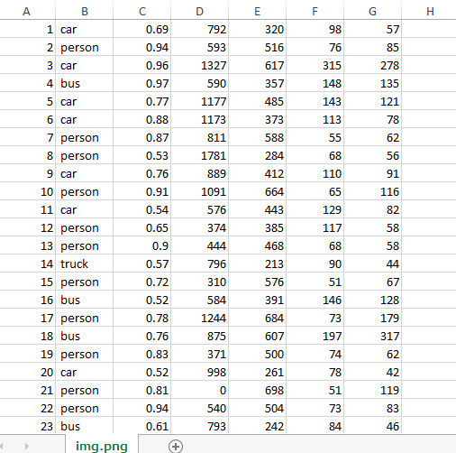
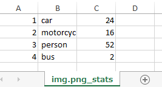
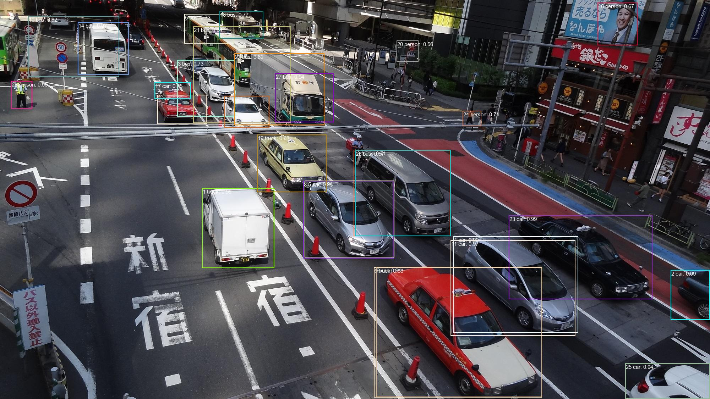
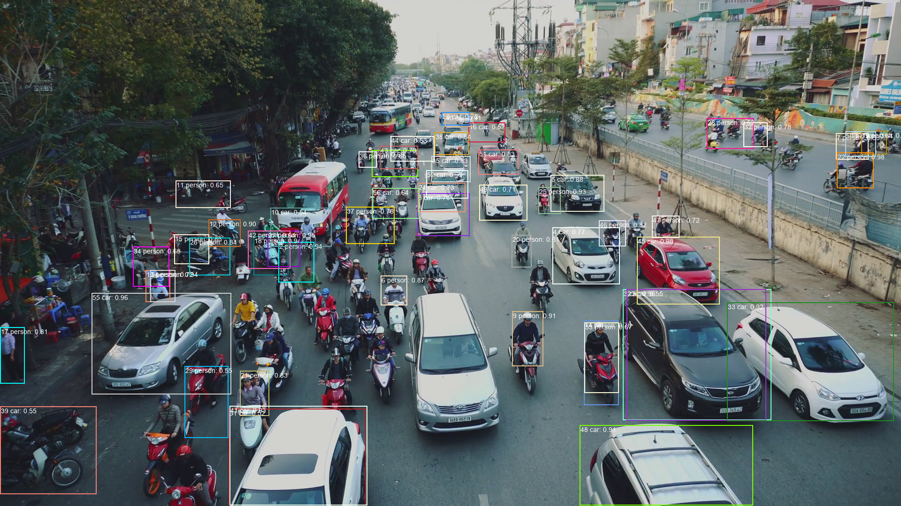
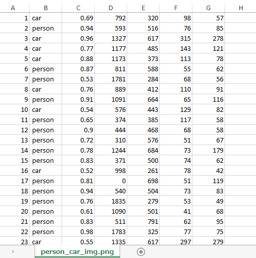
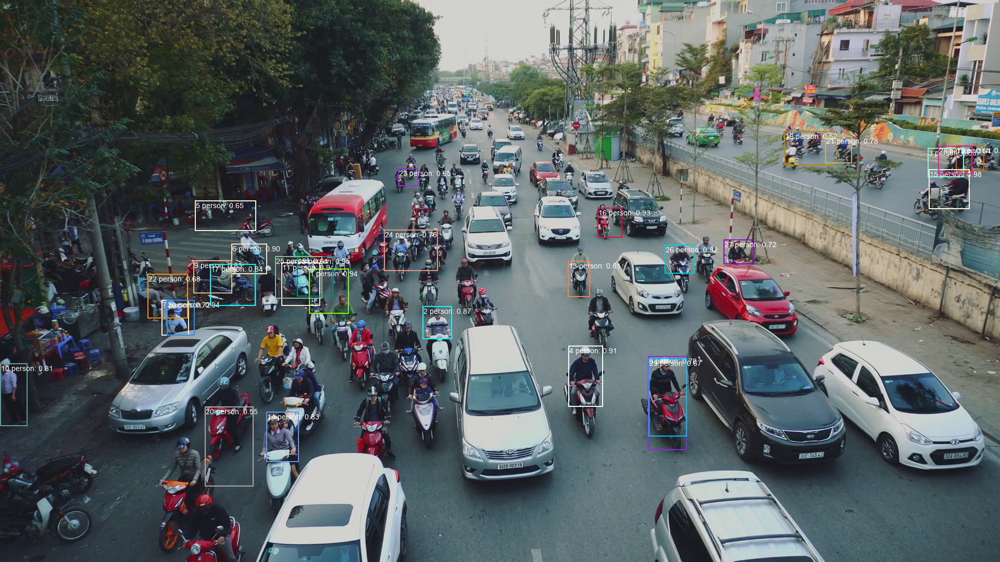
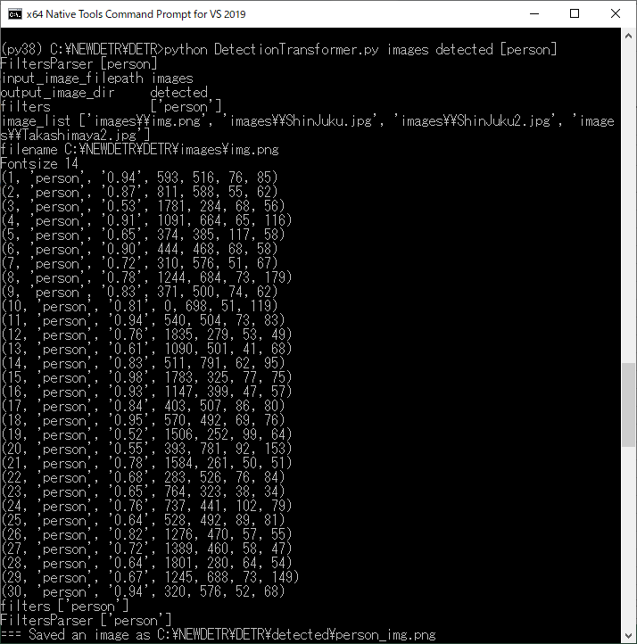

<h1>
DetectionTransformer
</h1>

<h4>
This DetectionTransformer class is based on the following web site
 https://colab.research.google.com/github/facebookresearch/detr/blob/colab/notebooks/detr_demo.ipynb
</h4>
 
See also:<a href='https://github.com/facebookresearch/detr'>DETR: End-to-End Object Detection with Transformers</a>
 
 
We have installed torch and torchvision in the following way:  
 
pip install torch==1.5.0+cpu torchvision==0.6.0+cpu -f https://download.pytorch.org/whl/torch_stable.html 
 
On PyTorch installation see :<a href="https://pytorch.org/resources/">Resources | PyTorch</a> 
 
 
Please run the following script to detect objects in an image file: 

<pre>
>python DetectionTransformer.py image_file_or_dir output_image_dir [filters]
</pre>
If image_file_or_dir were a single image file, 
the commnand above will generate a detected_image_file, detected_objects_csv_file, and objects_stats_csv_file in output_image_dir, respectively.
 
If image_file_or_dir were a diretory, the simlar process  will be applied to each image file (png, jpg). 
 

The optional <i>filters</i> parameter is a list of classes to be selected from the detected objects in a post-processing stage
after a detection process. 
 To specify the classes to be selected in the post-processing stage, we use the list format like this.
<pre>
  [class1, class2,.. classN]
</pre>

 
<b>Example 1:</b> 

<pre>
python DetectionTransformer.py images/img.png detected
</pre>

 

 
 
detected_objects 

 
 
objects stats_csv 

  
<b>Example 2:</b> 

<pre>
python DetectionTransformer.py images/ShinJuku.jpg detected
</pre>

  

  
<b>Example 3:</b> 

<pre>
python DetectionTransformer.py images/ShinJuku2.jpg detected
</pre>

  

  
<b>Example 4:</b> 

<pre>
python DetectionTransformer images/Takashimaya2.jpg detected
</pre>

  

  

<b>Example 5:</b> 
<b>
 Let's apply filters to draw matched labels specified by the filters on the input image.
 
</b>

<pre>
python DetectionTransformer.py images/img.png detected [person,car]
</pre>
In this case, the objects of <i>person</i> or <i>car</i> will be selected from the detected objects found in <i>images/img.png</i>.

  

  

  

  

<b>Example 6:</b> 
<b>
 You can specify input_image_dir, output_image_dir in the following way.  
</b>

<pre>
python DetectionTransformer.py images detected [person]
</pre>
By using the filter "[person]", you can count the number of persons in each image of the images directory.  

 

  

