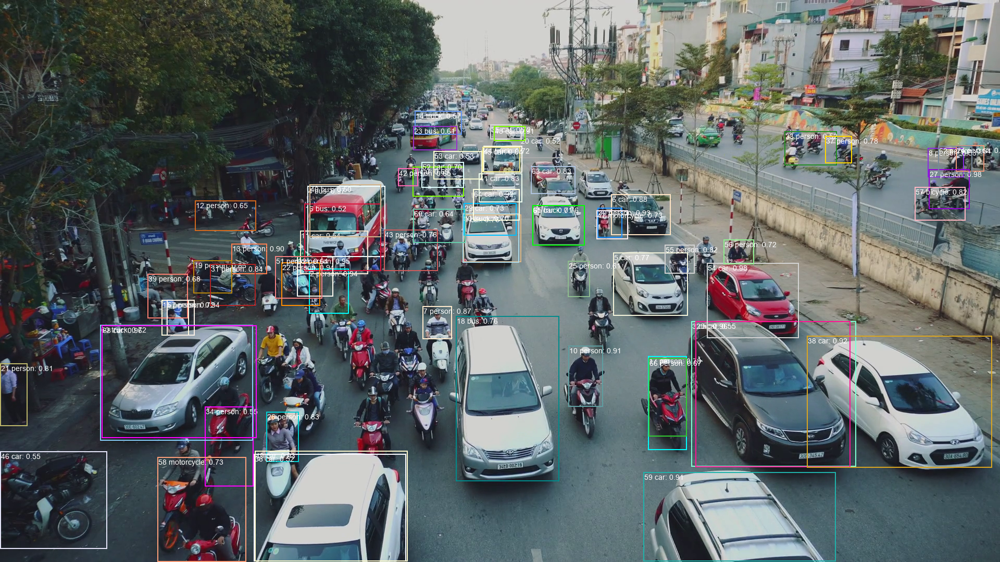
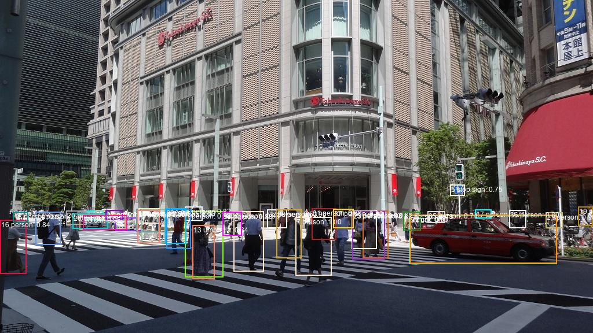

<h1>
DetectionTransformer
</h1>

<h4>
This DetectionTransformer class is based on the following web site
 https://colab.research.google.com/github/facebookresearch/detr/blob/colab/notebooks/detr_demo.ipynb
</h4>
 
See also:<a href='https://github.com/facebookresearch/detr'>DETR: End-to-End Object Detection with Transformers</a>
 
 
We have installed torch and torchvision in the following way:  
 
pip install torch==1.5.0+cpu torchvision==0.6.0+cpu -f https://download.pytorch.org/whl/torch_stable.html 
 
On PyTorch installation see :<a href="https://pytorch.org/resources/">Resources | PyTorch</a> 
 
 
Please run the following script to detect objects in an image file: 
 
python DetectionTransformer.py image_file
 
 

<b>Example 1:</b> 

python DetectionTransformer.py images/img.png

 

 
 

  
<b>Example 2:</b> 

python DetectionTransformer.py images/ShinJuku.jpg

  

  
<b>Example 3:</b> 

python DetectionTransformer.py images/ShinJuku2.jpg

  

  
<b>Example 4:</b> 

python DetectionTransformer images/Takashimaya2.jpg

  

  

<b>Example 5:</b> 
<b>
 Let's apply filters to draw matched labels specified by the filters on the input image.  
</b>

python DetectionTransformer.py images/img.png [person,motorcycle]

  

  

  

<b>Example 6:</b> 
<b>
 You can specify input_image_dir, output_image_dir in the following way.  
</b>

python DetectionTransformer.py images output [person]  
By using the filter "[person]", you can count the number of persons in each image of the images directory.  

 

  

